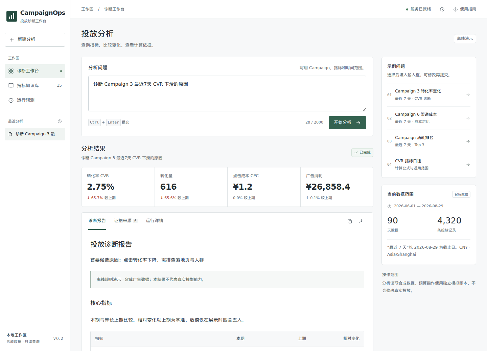

# CampaignOps Agent

**English** · [简体中文](README.zh-CN.md)

Query advertising metrics, look up metric definitions, and investigate changes in a browser workspace. A connected model plans SQL queries; application code enforces read-only access, calculates metrics, and ranks possible causes.



Current version: **v0.2.0rc1**. The main setup requires a model service. The `demo` mode is provided for offline demonstrations and regression tests.

## Features

- **Metric definitions:** search a versioned knowledge base for CTR, CVR, CPA, ROAS, and attribution rules, with the source text alongside the answer.
- **Queries and diagnostics:** validate read-only SQL for DuckDB or PostgreSQL, compare metrics and channels, and show the evidence behind possible causes.
- **Web workspace:** follow progress, read and download Markdown reports, inspect sources, restore previous runs, and cancel tasks. No frontend build is required.
- **Run management:** bounded queues, persistent idempotency, timeouts and limited retries, explicit model fallbacks, optional Redis caching, and timing and trace inspection.
- **Simulated budget changes:** propose, approve, execute, and roll back changes in a separate sandbox ledger. No real advertising platform is connected.

## Quick start: connect a model

Prepare Python 3.12–3.14, uv, Git, and a model endpoint with tool-call support, an enabled model ID, and an API key. From the repository root, install the dependencies for the Youtu-Agent path:

```bash
uv sync --python 3.12 --frozen --extra youtu
```

Copy [.env.example](.env.example) to `.env` only if no `.env` exists. Otherwise, edit the existing file and preserve its other settings. Enter the endpoint, model ID, and key supported by your account:

```dotenv
AGENT_MODE=youtu
DATABASE_BACKEND=duckdb
MODEL_BASE_URL=https://your-provider.example/v1
MODEL_NAME=your-enabled-model-id
MODEL_API_KEY=your-api-key
```

Initialize the sample dataset on first use, then start the workspace. These commands also work in PowerShell. `seed_data` overwrites the development database under `DATA_DIR`; skip it when preserving existing data, and stop the API before rebuilding the database.

```bash
uv run --no-sync python -m scripts.seed_data
uv run --no-sync python -m scripts.build_index
uv run --no-sync uvicorn app.api.main:app --host 127.0.0.1 --port 8000 --workers 1
```

Open **http://127.0.0.1:8000**. Interactive API documentation is at **http://127.0.0.1:8000/docs**; run records are at **http://127.0.0.1:8000/observability**. SQL planning for queries and diagnostics calls the model and consumes usage according to the provider's terms. Knowledge retrieval, metric calculations, and budget approvals are handled by application code.

`youtu` uses a pinned Youtu-Agent version. Alternatively, set `AGENT_MODE=openai` to call a Chat Completions-compatible endpoint through the HTTP client in the base dependencies. Both paths use a real model; the `openai` path does not need the `youtu` extra. A missing key or unavailable model causes model requests to fail. Alternative models on the same provider are attempted only when `MODEL_FALLBACKS` is explicitly configured; there is no automatic fallback to `demo`. Restart the API after changing configuration. See the [testing guide](docs/testing.md#真实模型与缓存) for compatibility probes.

`.env` is excluded from Git and Docker images. Simulated budget operations also require `APPROVAL_API_KEY`, entered in the proposal card. Keep this operator password separate from the model API key.

The synthetic dataset contains **90 days, 6 campaigns, 4,320 rows, and 6 types of injected anomalies**. “Last 7 days” uses the latest date in the dataset: August 23–29, 2026.

### Example questions

The interface and knowledge base are primarily in Chinese. Use these questions with the configured model; they also work in the offline demo:

| Task | Input |
| --- | --- |
| Look up a definition | `CTR 是如何计算的？` |
| Query a metric | `查询 Campaign 3 最近7天的 CVR` |
| Investigate an anomaly | `诊断 Campaign 6 最近7天渠道成本异常` |

Click **开始分析** (Start analysis), or press Ctrl+Enter. Source links open the original text; reports can be downloaded as Markdown. Browser history restores previous results by run ID.

## Offline demonstrations and tests

Use `demo` to run without model calls. Set these values in `.env`, or override them through the process environment, while preserving other settings:

```dotenv
AGENT_MODE=demo
DATABASE_BACKEND=duckdb
```

This mode requires no API key and only the base dependencies: `uv sync --python 3.12 --frozen`. Use the data initialization and startup commands above. With no `.env` or environment overrides, the code also defaults to `demo`; model-backed use requires explicitly setting `AGENT_MODE=youtu` or `openai`. Offline results test rules and application behavior, not model capability.

## Database support and extension

| Requirement | Current support |
| --- | --- |
| Local analytics database | DuckDB; `DATA_DIR` selects the directory, with a fixed filename of `campaignops.duckdb` |
| External relational database | PostgreSQL; set `DATABASE_BACKEND=postgres` and a read-only `POSTGRES_DSN` |
| Query caching | Optional Redis; it does not replace the analytics database |
| Dynamic data-source switching or cross-database queries | Not implemented; each service instance uses one analytics backend |
| Other engines, such as MySQL or ClickHouse | No existing adapters; connection, dialect, and execution controls need implementation |

For PostgreSQL or Redis outside Docker, install the `storage` extra. Keep Youtu dependencies when using that path: `uv sync --python 3.12 --frozen --extra youtu --extra storage`. PostgreSQL use still requires dataset metadata and a run-state directory under the service's `DATA_DIR`.

Connecting your own advertising data requires matching or adapting the schema, allowed fields, metric definitions, and diagnostic logic, and updating dataset versions and date ranges. Arbitrary business schemas are not discovered automatically. New tables or fields also require changes to the schema allowlist in code; editing `configs/schema.json` alone is insufficient. The existing PostgreSQL migration script initializes this project's synthetic data; it is not a general business-data importer. See the [database extension guide](docs/architecture.md#数据库扩展边界) for implementation points and validation requirements.

## Docker

Docker and Compose 2.24+ are required. Configure the model in `.env` as described above before starting. Compose passes that configuration to the API and uses DuckDB as the default analytics database:

```bash
docker compose up --build
```

Without a model-mode setting, the code still defaults to `demo`. The service binds to localhost on port 8000. It initializes data on the first start and preserves the database and run records in a named volume afterward. Set `API_PORT` to use a different port.

For PostgreSQL + Redis, run in Bash:

```bash
DATABASE_BACKEND=postgres REDIS_URL=redis://redis:6379/0 docker compose --profile storage up --build
```

In PowerShell, set `$env:DATABASE_BACKEND="postgres"` and `$env:REDIS_URL="redis://redis:6379/0"`, then run `docker compose --profile storage up --build`. Storage services communicate over the container network; their ports are not published. See [storage configuration](docs/architecture.md#postgresql-与-redis) for migrations, read-only credentials, and the scope of the local demo passwords.

## Validation

After initializing the offline data, check the evaluation tasks and HTTP endpoints:

```bash
uv run --no-sync python -m scripts.evaluate --mode demo
uv run --no-sync python -m scripts.smoke_http --mode demo
```

These commands use offline mode. See the [testing guide](docs/testing.md) for scoring rules, report exports, and model connectivity checks. Generated reports and runtime data are excluded from Git. Automated checks are defined in the [CI workflow](.github/workflows/ci.yml).

## Repository and documentation

| Path | Contents |
| --- | --- |
| `app/` | API, workspace, agent orchestration, SQL safeguards, analysis, and traces |
| `configs/` | Prompts, metric semantics, query examples, and regression thresholds |
| `data/` | Database schema, synthetic seeds, knowledge base, and evaluation tasks |
| `scripts/` | Setup, demos, evaluation, probes, and acceptance checks |
| `tests/` | Unit, integration, security, and regression tests |
| `docs/` | Usage, implementation boundaries, and validation guides |

Detailed documentation is currently in Chinese: [Architecture and security](docs/architecture.md) · [Data dictionary](docs/data-dictionary.md) · [API](docs/api.md) · [Testing](docs/testing.md).

## Limits

This project is a local demonstration built around synthetic data. The fixed evaluation set is for regression testing; full marks do not establish performance on real business data or unseen questions. Metrics and candidate causes come from deterministic code. Confidence values are rule-based scores, and candidate causes are not causal proof. Passing SQL safety checks does not establish that a query answers the intended business question.

Run a single process with one worker. The analysis API has no login, tenant isolation, or quota management and should listen on localhost. The simulated budget ledger is separate from both the analytics database and real advertising platforms. Production deployment requires identity and data isolation, access controls, and operational support.

## Acknowledgments

Thanks to the maintainers and contributors of [Tencent Youtu-Agent](https://github.com/TencentCloudADP/youtu-agent) and the open-source projects below. Their work provides the model framework, database access, API, and rendering used here.

| Upstream project | Use in this project | Integration path |
| --- | --- | --- |
| [Youtu-Agent](https://github.com/TencentCloudADP/youtu-agent) | `SimpleAgent` and `AgentConfig` for model-driven SQL planning | [app/agent/runners.py](app/agent/runners.py) |
| [OpenAI Agents SDK](https://github.com/openai/openai-agents-python) / [OpenAI Python SDK](https://github.com/openai/openai-python) | Tool registration, model adapter, and async client in the Youtu path | [app/agent/runners.py](app/agent/runners.py) |
| [HTTPX](https://github.com/encode/httpx) | HTTP client for the direct model adapter and model probes | [app/agent/runners.py](app/agent/runners.py), [scripts/model_probe.py](scripts/model_probe.py) |
| [DuckDB](https://github.com/duckdb/duckdb) | Local analytics database and synthetic data initialization | [app/tools/database.py](app/tools/database.py), [scripts/seed_data.py](scripts/seed_data.py) |
| [SQLGlot](https://github.com/tobymao/sqlglot) | SQL parsing, allowlist validation, and dialect conversion | [app/guardrails/sql.py](app/guardrails/sql.py), [app/tools/database.py](app/tools/database.py) |
| [FastAPI](https://github.com/fastapi/fastapi) | HTTP API and SSE endpoints | [app/api/main.py](app/api/main.py) |
| [Psycopg](https://github.com/psycopg/psycopg) / [redis-py](https://github.com/redis/redis-py) | PostgreSQL connections and Redis query caching | [app/tools/database.py](app/tools/database.py), [app/tools/cache.py](app/tools/cache.py) |
| [markdown-it-py](https://github.com/executablebooks/markdown-it-py) | Markdown report rendering | [app/api/presentation.py](app/api/presentation.py) |

Youtu-Agent is pinned to [commit c2caa539](https://github.com/TencentCloudADP/youtu-agent/tree/c2caa539f4c95ae1c39ed24dc8a99cb3651e1d5d). Dependency declarations and resolved versions are in [pyproject.toml](pyproject.toml) and [uv.lock](uv.lock); license attribution is in [third-party notices](THIRD_PARTY_NOTICES.md).

## License

[MIT](LICENSE). See [third-party notices](THIRD_PARTY_NOTICES.md) for dependency attribution.
