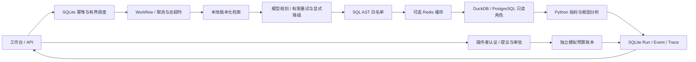

# v0.2 架构与边界

模型只调用 `submit_sql` 提交 SQLPlan；检索、SQL 校验、数据库查询和根因计算由应用控制。模型没有 Shell、文件、HTTP 或预算执行工具。



状态为 `queued → running → succeeded / failed / approval_required / cancelled`，终态不能被后来的事件覆盖。状态与结果事件在一个 SQLite 事务提交。SSE 断开仅停止订阅；取消任务须调用 `/cancel`，取消会中断模型协程和数据库查询，释放执行槽位。进程重启把未完成任务标记失败，原幂等键仍指向该任务，主动重试须使用新键。

默认执行并发 4、等待队列 8；两者都满时返回 429。幂等键与规范化请求哈希持久化到 SQLite，相同键但不同参数返回 409。有效期跟随运行记录保留期，默认 30 天；重启时清理到期终态及关联事件、幂等映射。单进程调度不支持多个 API worker。

模型连接超时 5 秒、单次总超时 60 秒，最多重试 2 次，指数退避并抖动；只重试连接/读取失败、408、429、500、502、503、504 和超时。鉴权错误、无效响应、协议不兼容、SQL 拒绝不重试。SDK 自动重试关闭。`MODEL_FALLBACKS` 是显式配置的同一服务模型列表，默认为空；不会降级成 demo。取消或超时不保证供应商未计费，缺失用量时标记 `usage_complete=false`，成本为空。

检索为本地内存操作，没有网络连接；总超时默认 3 秒，循环检查取消标记。SQL 连接超时默认 3 秒（PostgreSQL），执行超时 5 秒、最大 200 行和 256 KiB。DuckDB 连接无网络阶段，独立只读连接，禁用外部访问与扩展，单查询 1 线程、256 MiB。PostgreSQL 使用只读事务、服务器 statement/lock timeout 和专用角色；管理员 DSN 只交给迁移进程。方言在校验后转换，规范化 SQL 哈希保持一致。

## PostgreSQL 与 Redis

默认 `DATABASE_BACKEND=duckdb`。可选依赖由 `uv sync --extra storage` 安装。用管理员配置执行一次 `uv run python -m scripts.migrate_postgres`：原始 `data/schema.sql` 作为版本化迁移源，SHA256 写入 `schema_migrations`；已有版本不一致时拒绝隐式覆盖。仅初始化合成数据，创建 `campaignops_reader`，撤销写权限并默认只读。

非容器部署使用 `.env` 的 `POSTGRES_ADMIN_DSN` 和 `POSTGRES_READER_PASSWORD` 执行迁移，再配置只读 `POSTGRES_DSN`、`DATABASE_BACKEND=postgres`；API 不应继承管理员凭证。数据更新应先停止 API，通过显式迁移完成，并同步 `manifest.json` 版本。

Compose 默认只启动 DuckDB API。存储模式可在**没有同名环境变量覆盖**时运行：

```bash
DATABASE_BACKEND=postgres REDIS_URL=redis://redis:6379/0 docker compose --profile storage up --build
```

Windows 可先在当前 Shell 设置两个变量再运行 Compose。容器内 DSN 的数据库主机名为 `postgres`，不是 `localhost`。Compose 的默认数据库密码仅用于本地合成演示；若改密码，管理员/只读 DSN 必须同步更新。存储服务没有映射宿主机端口。`migrate` 完成后 API 才启动，API 环境明确清空管理员 DSN。`API_PORT` 可调整宿主端口，默认仍为本机 8000。两种存储模式的使用方法见 [README](../README.zh-CN.md#docker)。

Redis 是可丢弃缓存。键包括命名空间版本、数据库后端、manifest 摘要、查询哈希和输出限制，默认 TTL 300 秒。幂等映射和短期运行状态写入 Redis 副本；SQLite 始终决定是否创建任务。SQL 使用 `SET NX PX` 租约避免同时填充，Lua 校验持有者后写入与解锁；等待有上限，故障回到数据库。命名空间或数据版本变化使旧键失效。缓存异常产生 `cache_degraded` Trace；Redis 故障不会阻止核心只读查询。

连接与取消实现参考 [Psycopg API](https://www.psycopg.org/psycopg3/docs/api/connections.html)，缓存租约参考 [Redis 锁说明](https://redis.io/docs/latest/develop/clients/patterns/distributed-locks/)。

## 数据库扩展边界

当前实现提供 DuckDB 和 PostgreSQL 两个分析后端，由服务启动配置选定。连接与 SQL 方言转换集中在 `app/tools/database.py`，执行限制和取消控制在 `app/tools/sql.py`。这里尚无动态插件注册、请求级数据源选择或跨库联查；SQLite 负责本地运行状态与审批账本，Redis 只提供缓存。

| 扩展内容 | 需要同步处理的位置 |
| --- | --- |
| 使用自有 PostgreSQL 数据 | 准备符合广告数据契约的表或视图、专用只读角色和 `POSTGRES_DSN`；维护本地 `DATA_DIR/manifest.json` 的日期、数据版本等元信息 |
| 增加表、字段或指标 | `data/schema.sql`、`app/domain/semantics.py` 的白名单与指标定义、`configs/schema.json` / `metrics.json`、查询示例和知识库；诊断所需字段变化还要调整规划与分析代码 |
| 增加数据库引擎 | `Settings.database_backend`、连接驱动、SQL 方言转换、只读权限、查询超时与取消、结果类型转换及存储契约测试 |

接入其他数据前，还需处理当前业务约束：Campaign 标识按 1–6 验证和解析，查询窗口最长 91 天，部分币种、时区和界面说明按合成数据设置。仅替换连接地址或只修改配置 JSON，无法完成任意业务数据的适配。应同步检查请求模型、`app/agent/planning.py`、工作台元信息和报告说明。

`scripts.migrate_postgres` 复制本项目的合成 DuckDB 数据并安装固定 schema；它不是通用导入器，已安装 schema 的版本发生变化时会拒绝隐式覆盖。已有业务库应采用专门的导入或迁移流程，保留原数据。数据更新后维护 manifest 版本；切换数据源时隔离缓存命名空间，避免复用旧来源的结果。新增后端需通过查询结果一致性、空值与小数、只读权限、超时取消和缓存隔离检查，才可计入已支持范围。

## 信任边界与审批

| 不可信来源 | 控制 |
| --- | --- |
| 用户问题 | 输入长度/日期/对象校验，常见越权指令预拦截；不授予工具权限 |
| 检索文档 | JSON 数据字段 `retrieved_untrusted`，角色覆盖/泄密指令检测，引用版本与正文校验 |
| 模型及工具返回 | SQLPlan 契约、AST 白名单、只读角色、结果大小与指令检测；数值分析不交给模型 |

关键防线是能力隔离和数据库权限，正则检测只是补充，不能承诺识别所有未知 Prompt Injection。SQL 安全通过也不代表业务理解正确。

预算提议不会直接修改数据。独立模拟审批要求 `X-Operator-Key`，服务端将其绑定到配置的 `APPROVAL_ACTOR`。提议冻结操作者、摘要、参数 SHA256、原预算与修订号、到期时间；批准时只返回一次执行令牌，数据库只保存令牌摘要。执行在同一 SQLite 写事务中检查身份、状态、参数、令牌、期限与预算修订号，并更新模拟账本。重复执行、篡改参数、过期、被拒绝或旧修订均被拒绝。

模拟账本初始每个 Campaign 日预算为 1000，独立于分析事实库。回滚生成新提议，仍须批准和执行。`proposed/approved/rejected/expired/executed` 记录到独立 `approval_audit` 表，可通过 API 查询；即使分析 Run 已终止，审批日志也可继续完整记录。审批审计不随普通 Trace 自动删除。

日志只向 stdout 输出事件元数据；密钥、Bearer、邮箱和敏感字段在写 Trace 前脱敏。Compose 将 stdout 日志轮转为 3 × 10 MiB。成本使用 `configs/model_prices.json` 的版本与精确模型 ID；没有价格或缺少供应商用量则保持 null。`/observability` 显示最近任务和各阶段 P50/P95，可下钻 Trace。这里没有分析接口鉴权、租户隔离或分布式任务恢复，只适合本机合成数据演示。
